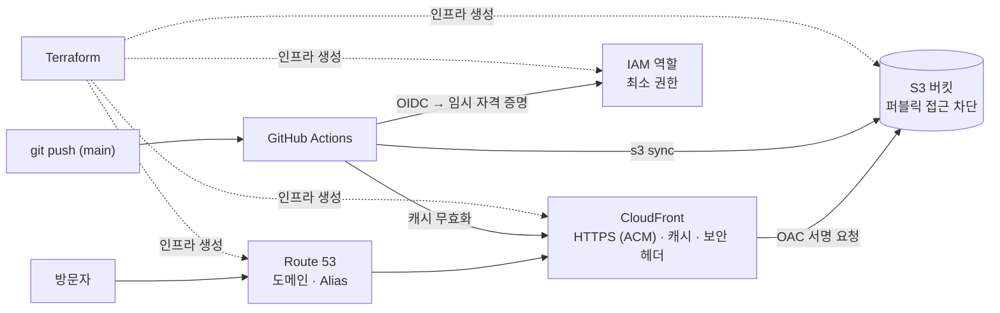

# portfolio — 정적 포트폴리오 사이트와 AWS 배포 인프라

> 포트폴리오 사이트(React)를 **Terraform으로 구성한 S3 · CloudFront · Route 53** 위에 올리고, `main`에 push하면 **GitHub Actions가 OIDC로 자동 배포**하는 저장소입니다.


| 항목 | 내용 |
|---|---|
| 사이트 | https://(도메인) <!-- 배포 후 입력 --> |
| 기간 | 2026.10 ~ |
| 유형 | 개인 프로젝트 |

---

## 아키텍처



## 설계 선택과 이유

| 선택 | 이유 |
|---|---|
| **S3 퍼블릭 차단 + CloudFront OAC** | 버킷을 웹 호스팅으로 공개하지 않고, 특정 CloudFront 배포에서 온 서명된 요청만 읽도록 버킷 정책을 `AWS:SourceArn`으로 제한 |
| **ACM 인증서를 us-east-1에 생성** | CloudFront는 us-east-1의 인증서만 연결할 수 있어 provider alias로 분리. 검증은 Route 53 DNS 레코드로 자동화 |
| **SPA 라우팅을 CloudFront 오류 응답으로 처리** | `/projects/xxx`는 S3에 파일이 없어 403이 오므로 `/index.html`을 200으로 돌려주고 React Router가 화면을 그림 |
| **GitHub Actions OIDC** | 장기 Access Key를 Secrets에 저장하지 않음. 신뢰 정책에서 `repo:alberione1110/portfolio:ref:refs/heads/main`만 허용 |
| **배포 역할 최소 권한** | 이 버킷의 객체 읽기·쓰기·삭제와 이 배포의 캐시 무효화만 허용 |
| **캐시 전략 분리** | 해시가 붙은 JS·CSS는 1년 `immutable`, `index.html`은 `no-cache` + 무효화. 새 배포가 바로 보이면서 정적 파일은 엣지에 오래 남음 |
| **Terraform state를 S3에 저장** | 버전 관리·암호화된 버킷에 저장하고, Terraform 1.10의 `use_lockfile`로 DynamoDB 없이 잠금 |
| **인프라 변경은 로컬에서 apply** | CI에는 배포 권한만 주고, 인프라를 바꿀 수 있는 넓은 권한은 주지 않음. CI는 `fmt`·`validate`만 검사 |
| **월 예산 알림 (AWS Budgets)** | 설정 실수로 비용이 나가는 것을 메일로 바로 확인 |

## 예상 비용

| 항목 | 비용 |
|---|---|
| 도메인 (Route 53) | 연 약 $13~15 (TLD에 따라 다름) |
| 호스팅 영역 | 월 $0.50 |
| S3 · CloudFront | 개인 포트폴리오 트래픽이면 무료 사용량 범위 안 |
| ACM 인증서 | 무료 |

---

## 저장소 구조

```text
portfolio/
├─ site/                     # React + Vite
│  └─ src/
│     ├─ data/               # profile.js, projects.js (내용은 여기만 수정)
│     ├─ pages/              # Home, ProjectDetail, NotFound
│     └─ components/Layout.jsx
├─ infra/
│  ├─ bootstrap/             # Terraform state 버킷 (최초 1회)
│  └─ live/                  # S3, CloudFront, OAC, ACM, Route 53, OIDC 역할, Budgets
└─ .github/workflows/
   ├─ ci.yml                 # 사이트 빌드, terraform fmt/validate
   └─ deploy-site.yml        # main push → S3 업로드 → CloudFront 무효화
```

## 로컬 실행

```bash
cd site
npm install
npm run dev        # http://localhost:5173
```

처음부터 배포까지의 전체 절차는 [docs/SETUP.md](docs/SETUP.md)에 있습니다.
